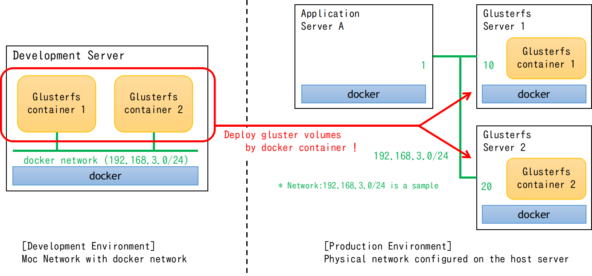
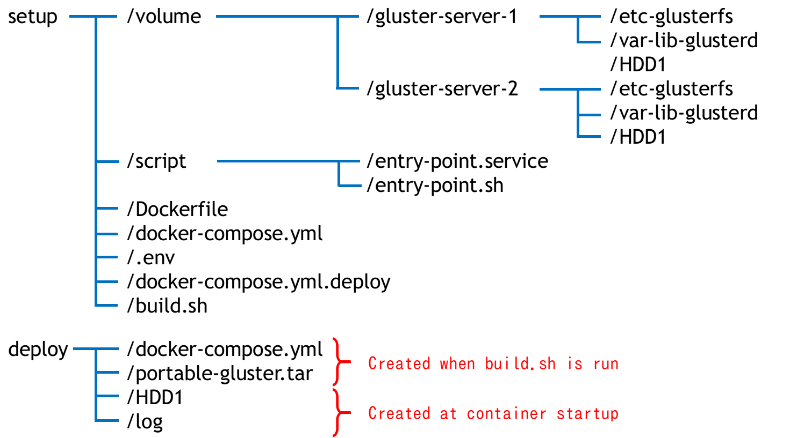
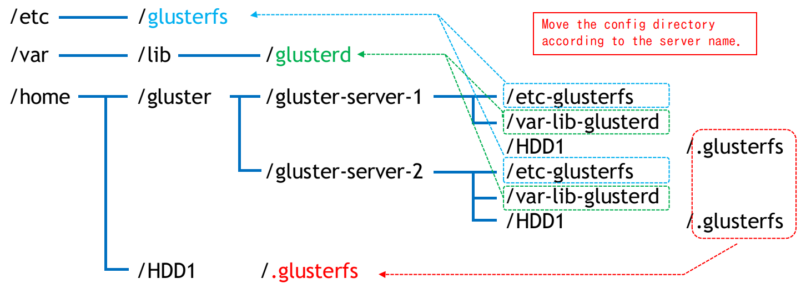

# ポータブルGluster

このリポジトリには、2つのレプリカを持つGlusterfsコンテナのDockerイメージを作成するツールが含まれています。



# 目次

- [Dependancy](#dependency)
- [Usage](#usage)
  - [Directory-Structure](#directory-structure)
  - [Setting](#setting)
  - [Building](#building)
  - [Deployment](#deployment)
- [License](#license)

# Dependency

- このツールは、以下のソフトウェアを使用します。
  - docker and docker-compose
  - bash
  - envsubst

# Usage

## ディレクトリ構成



## 設定

- 本ツールでは、setup/.envファイルに定義することで、以下のパラメータ名を変更することができます。
  - NETWORK_ADDR : 製品環境のネットワークアドレス
  - HOSTNAME_1 : Gluster-container-1のホスト名
  - IP_ADDR_1 : Gluster-container-1のIPアドレス
  - HOSTNAME_2 : Gluster-container-2のホスト名
  - IP_ADDR_2  : Gluster-container-2のIPアドレス
  - VOLUME_NAME : Glusterのボリューム名

## ビルド

- setupディレクトリに移動後、以下のようにbuild.shを実行してください。
  - build.shのオプションは-h（または--help）を引数に実行すると確認できます。
  - `AAAAA:BBBBB` はdocker image:tagのことです。

- build.sh実行後、deployディレクトリにdocker image (portable-gluster.tar) デプロイ用docker-compose.ymlが生成されます。

```command
cd [setup directory]
./build.sh -t AAAAAA:BBBBBB   
```

## デプロイ

- デプロイディレクトリの下にあるものを、本番環境の任意のディレクトリに転送します。

- setupディレクトリに移動した後、deployディレクトリにあるdockerイメージを読み込みます。
  - dockerコマンドが使えるユーザで実行すること。
- docker iamgeをロードしたら、次のようにdockerコンテナを起動します。
  - 2つのサーバで同時に実行してください。
  - 起動ログはlogディレクトリに出力されます。

```command
$ cd [deploy directory]
$ docker image load -i portable-gluster.tar
-- in the server 1 ----------------------------------
$ docker-compose up -d gluster-server-1
-- in the server 2 ----------------------------------
$ docker-compose up -d gluster-server-2
```

### 備考

- Glusterコンテナは、下図のように起動時にコンテナ内のGlusterfs設定ディレクトリを指定した場所に移動する。



# ライセンス

このツールはWTFPLでリリースされています（LICENSE参照）。
